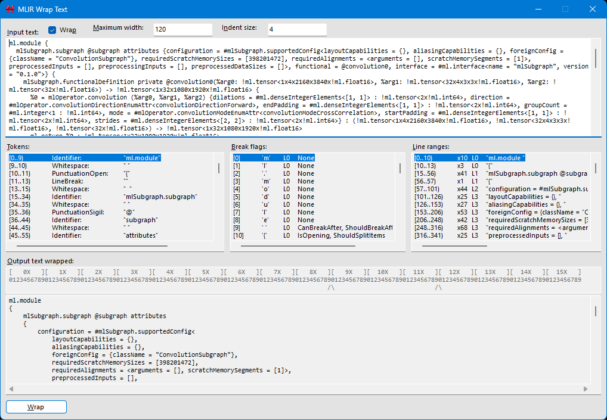
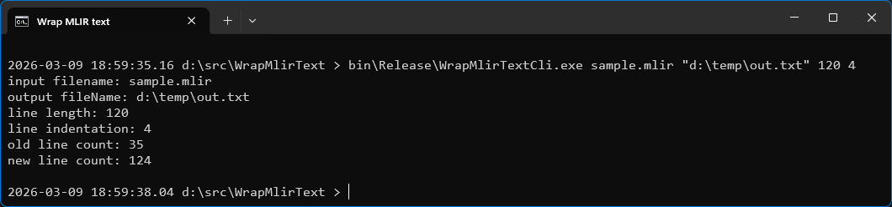

# WrapMlirText

This utility wraps [MLIR text](https://mlir.llvm.org/docs/LangRef/), which can be very long (500+ columns!) when taken straight out of bytecode decompilation. There is both a command line tool and interactive UI tool.

## GUI form:


## CLI form:


Usage:
```
WrapMlirText <inputTextFile> <outputTextFile> <lineLength> <lineIndent>
```

## Requirements:
- Tested on Windows 10/11 (but probably works back to Windows 7 🤞).
- Requires .NET 4.7.2.

## Building:
- Open WrapMlirText.sln in Visual Studio Professional/Community 2022 17.14.27.
- Press F7 to build.
- Press Ctrl+F5 to run.
